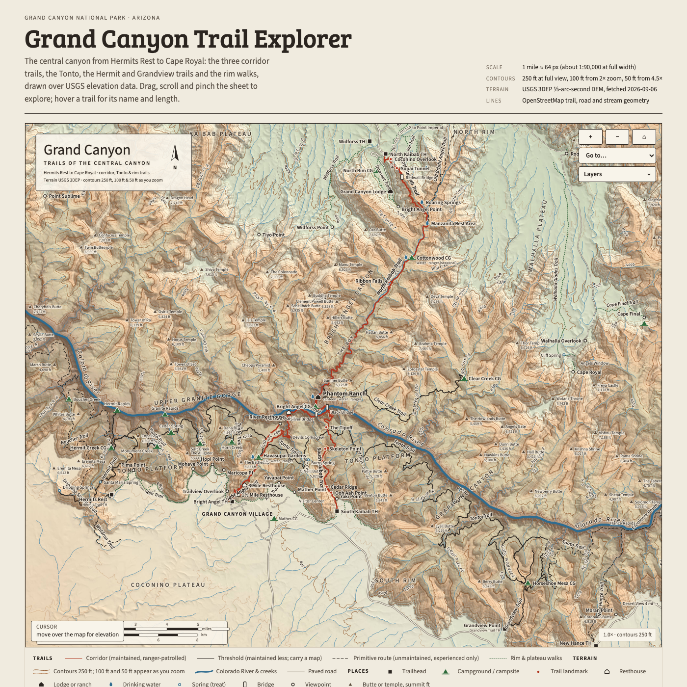
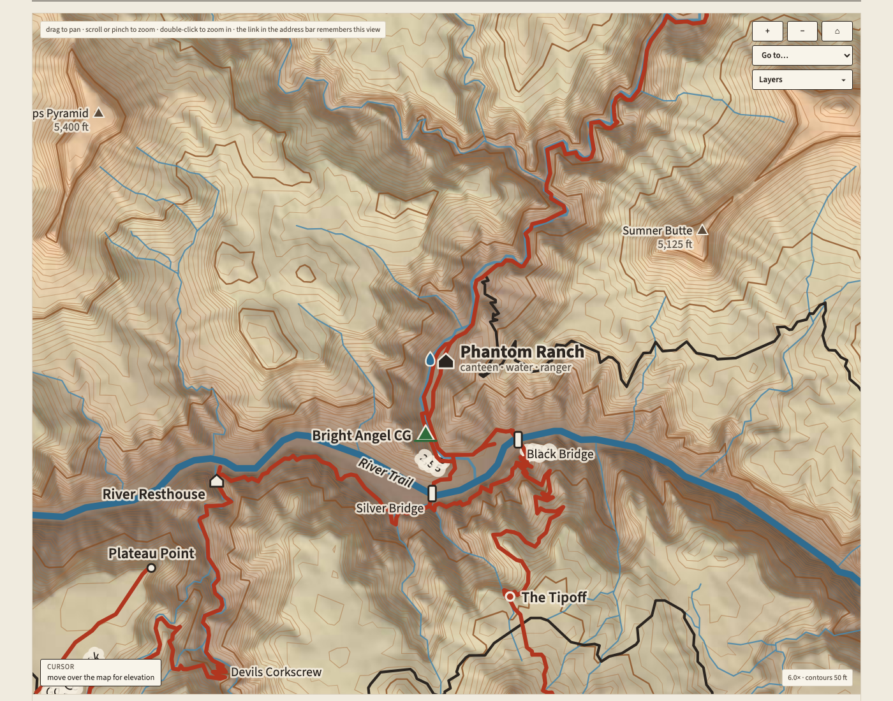

# Grand Canyon trail maps

Two hand-designed maps of the central Grand Canyon, rendered as self-contained HTML pages from
USGS elevation data and OpenStreetMap vector data, plus the pipeline that produced them so the
process can be repeated for another area or another interval.

| Output | What it is | Size |
|---|---|---|
| `output/grand_canyon_trail_sheet_static.html` | Print-style sheet: shaded relief, 250 ft contours, trails by NPS zone, campgrounds, mileage tables, rim-to-rim profile | 2.3 MB |
| `output/grand_canyon_trail_explorer_interactive.html` | Same sheet with pan/zoom, contour ladders that sharpen with zoom (250 → 100 → 50 ft), layer toggles, place finder, trail hover, cursor elevation, shareable view in the URL hash | 6.9 MB |

Both pages are single files: terrain images are embedded as base64 JPEG, contours as inline SVG
paths, and fonts are embedded from checked-in, licensed assets. They render in light and dark themes.




## Repeat the build

```bash
npm ci
npm run browsers:install
python3 -m venv .venv
.venv/bin/pip install -r pipeline/requirements.txt
./pipeline/run_all.sh          # explicit fetch + process + candidate build
npm run build:maps             # subsequent builds from local caches
npm run verify:maps            # independent audits, scenes and performance
npm run promote:maps           # revalidate and replace both local output files
```

See [layout validation](docs/LAYOUT_VALIDATION.md) for checks, reports, required coverage and
supported layout limits. Builds write candidates into `pipeline/`; promotion preserves the
existing outputs if a check fails. Intermediates and browser caches are Git-ignored.

## Read next

- [Documentation index](docs/index.md) — routes by task to contracts, guides, plans and historical context
- [Agent working rules](AGENTS.md) — scope, document authority, source/output ownership and evidence expectations
- [Process](docs/PROCESS.md), [validation](docs/VALIDATION.md) and [layout validation](docs/LAYOUT_VALIDATION.md) — build stages and automated release checks

The automatic-layout implementation follows the [design and plan](docs/plans/2026-09-08-automatic-map-layout-design.md);
release evidence determines whether candidate maps may replace the delivered edition.
Lidar delivery remains a proposal. [HANDOFF.md](HANDOFF.md) records the original session.


## Layout

```
pipeline/   fetch_*.py, process_dem*.py, osmdata.py, build_static.py, build_interactive.py, run_all.sh
docs/       task index, contracts, guides, plans and preview images
output/     the finished HTML maps
```
