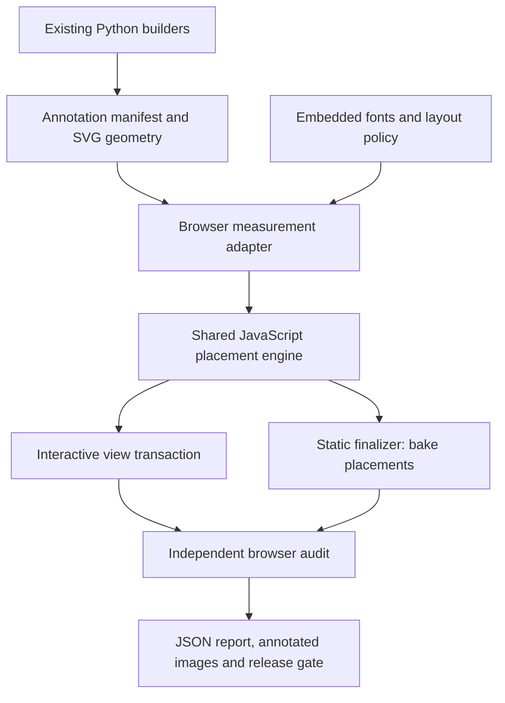

# Automatic map layout and validation — draft design

**Status:** Draft for review; no implementation has been made.
**Date:** 2026-09-08
**Companion:** [Implementation plan](2026-09-08-automatic-map-layout-plan.md)

## 1. Outcome

The static sheet and interactive explorer should place labels automatically and check their
own output. The explorer must prevent forbidden overlaps at the actual displayed zoom,
including intermediate frames during a gesture. The static build must fail if its final
layout violates the same rules or loses required information.

This requires two separate acceptance conditions:

1. **Layout validity:** no forbidden intersections, clipping, illegible sizes or ambiguous
   displacement within the declared rendering profile.
2. **Information coverage:** required features are represented, and the map retains a useful
   amount of optional information. An empty label layer cannot pass.

There is no promise to display every name simultaneously in a finite viewport. When space
runs out, use another position, an approved shorter name, a facility group, or suppression
of optional annotations. A name hidden on the explorer remains available in its feature
directory and selection details. A required static label that cannot fit causes a reported
build failure; it is never silently omitted.

## 2. Current implementation and constraints

- `pipeline/build_static.py` and `pipeline/build_interactive.py` independently contain
  point offsets, selected trail segments, region anchors and special-case peak placement.
- In the interactive builder, `L()`, `anchored()` and `trail_label()` emit positioning
  transforms directly. `place()` appends symbols and labels to separate SVG groups.
- River and contour labels use SVG `textPath`. Other labels can be rotated and multiline.
- The explorer's `apply()` changes `viewBox`, label scale (`zoom^-0.55`), line scale
  (`zoom^-0.5`) and contour classes. It performs no collision measurement or placement.
- Contours change at 2× and 4.5×; supported zoom is currently 1×–14×. Cartouche and scale
  visibility also change just above the overview, at 1.02×.
- Controls, a layers popup, cursor readout and a moving tooltip occupy space above the map.
- Fonts come from Google Fonts. There are no checked-in browser tests or package manifest.
- Finished HTML exists in `output/`; downloaded DEM/OSM intermediates are absent from this
  checkout. An audit can start from the finished artifacts without refetching anything.
- `pipeline/run_all.sh` writes HTML into `pipeline/`. Promoting it into `output/` is currently
  manual. Existing published pages are outside this change.

Keep SVG, our terrain, styles, geographic projection, existing map controls and single-file
delivery. Geographic coordinates, trail geometry and elevation processing are unchanged by
layout. Do not move a campsite's true location to make its label fit.

## 3. Scope and decisions

### In the first complete release

- Inventory and audit every map annotation: places, symbols, peaks, trail names, water names,
  region names, contour numbers and off-frame pointers.
- Shared rules and placement code for static and interactive maps.
- Screen-space collision measurement with explicit padding and semantic exceptions.
- Automatic point and line candidates; bounded region candidates around existing anchors.
- Continuous-zoom enforcement, stable placement and layer-aware visibility.
- Static finalization with positions baked into the HTML/SVG.
- Independent browser validation, reproducible reports and local release checks.
- A complete feature directory so hidden point annotations can still be found and selected.

### Follow-on work

Automatic region boundaries, general clustering of unrelated POIs, automatic print insets,
worldwide label generation, GIS source reconciliation, sun/shade, lidar, GPU rendering,
hosted tiles and Avenza/PDF georeferencing are separate projects. The initial release groups
facilities at the same declared place, not arbitrarily nearby campsites. Existing regional
anchors remain inputs until reliable area geometry is available.

### Approach comparison

| Approach | Benefit | Limitation | Decision |
|---|---|---|---|
| Add shared placement to current SVG | Retains appearance, standalone HTML and one static/interactive rule set | We own curved-text geometry and interaction performance | Recommended |
| Migrate explorer to MapLibre | Existing alternative anchors, symbol priorities and collision behavior | Explorer migration; print layout and trail-obstruction rules still need work | Revisit for tiled maps |
| Audit and precompute a few zoom tiers only | Useful early diagnostics; simpler runtime | Does not establish correctness between tiers, around controls or after resizing | First milestone only |

MapLibre's [variable anchors](https://maplibre.org/maplibre-style-spec/layers/#text-variable-anchor)
and [symbol priorities](https://maplibre.org/maplibre-style-spec/layers/#symbol-sort-key)
support the alternative above. This proposal does not depend on adopting that library.

## 4. Architecture



Use plain JavaScript ES modules for geometry, candidate selection and placement. Node's test
runner exercises the pure modules; Playwright exercises browser measurement, gestures and
the final artifacts. A development-only esbuild step produces a browser bundle that Python
embeds into the HTML. There is no Node service or external runtime script for readers.

Python emits stable IDs, annotation relationships and references to existing rendered paths.
It does not reimplement text measurement or the layout algorithm. A small shared Python
module handles the manifest contract and safe HTML embedding; wholesale deduplication of
the two existing builders is outside scope.

### Proposed files

| Path | Responsibility |
|---|---|
| `pipeline/label_manifest.py` | Manifest schema checks and SVG/JSON embedding helpers |
| `pipeline/labels/policy.json` | Priorities, sizes, spacing, visibility and exceptions |
| `pipeline/labels/schema.js` | Runtime manifest validation |
| `pipeline/labels/geometry.js` | Transforms, conservative shapes, intersection predicates |
| `pipeline/labels/spatial-index.js` | Screen-space uniform grid; only broad-phase filtering |
| `pipeline/labels/measure.js` | Font readiness and browser-derived annotation metrics |
| `pipeline/labels/candidates.js` | Point, straight-line, curved-line and region candidates |
| `pipeline/labels/place.js` | Deterministic placement and bounded local improvement |
| `pipeline/labels/runtime.js` | Atomic view updates, selection and invalidation |
| `pipeline/labels/browser.js` | Browser entry point used by both modes |
| `pipeline/labels/fonts/` | Versioned font assets and their redistribution notices |
| `scripts/build-labels.mjs` | Bundle the browser modules |
| `scripts/audit-map.mjs` | Read-only audit CLI; legacy and manifest adapters |
| `scripts/layout-static.mjs` | Finalize staging static HTML |
| `scripts/verify-maps.mjs` | Run release checks and promote successful outputs |
| `tests/labels/`, `tests/browser/`, `tests/python/` | Algorithm, rendered behavior and manifest tests |
| `artifacts/layout/` | Ignored diagnostic reports, geometry overlays and screenshots |

### Manifest contract

Separate a geographic feature from its optional repeated annotations. IDs must survive
changes in traversal order and label visibility. Use source IDs where available and curated
slugs for hand-authored features; line annotations add a stable segment/repeat identifier.

```json
{
  "version": 1,
  "map": {"width": 1300, "height": 1070, "coordinateSpace": "svg"},
  "features": [{
    "id": "place:phantom-ranch",
    "name": "Phantom Ranch",
    "kind": "lodge",
    "anchor": [599.0, 559.0],
    "directory": true
  }],
  "annotations": [{
    "id": "label:phantom-ranch",
    "featureId": "place:phantom-ranch",
    "elementId": "label-phantom-ranch",
    "kind": "point-label",
    "style": "major-place",
    "text": "Phantom Ranch",
    "subtext": "canteen · water · ranger",
    "variants": [{"text": "Phantom Ranch", "subtext": null}],
    "preferred": {"dx": 10, "dy": -3, "anchor": "start"},
    "priority": 900,
    "requiredProfiles": ["static-default"],
    "layer": "places"
  }]
}
```

Coordinates in this example are illustrative; builders supply actual projected values.
Additional annotation types include symbol, facility-group, line-label, region-label and
edge-pointer. Line records reference a geometry element, own feature, repeat distance and
permitted direction. Region records initially provide an anchor, bounded displacement and
angle range; do not infer a large free-placement area from a name alone.

Embed manifests as inert JSON with `<` escaped as `\u003c` and validate before use. A name
containing `</script>` must not break out of its data element. Construct visible text with
DOM text APIs, not unescaped HTML. Unknown elements, missing IDs and non-finite geometry are
errors, not annotations silently excluded from the audit.

## 5. Collision and readability policy

All interactive distances are CSS screen pixels, independent of device pixel ratio. The
static profile uses reference coordinates at a 1300 CSS-pixel map width; actual W/H are read
from the manifest. Physical export dimensions must be declared before claiming any minimum
print size. A shrunken overview of the static sheet on a phone is not a separate print layout.

Initial interactive typography targets are 12 px place names, 10 px secondary/contour text,
13 px trail names and 14 px major/region names. Preserve font families, weights and colors.
Replace annotation use of `zoom^-0.55` with constant screen sizes in the interactive profile;
the current line-weight rule can remain. This is a deliberate readability change, to be
benchmarked on the named dense areas before the policy is frozen. Do not shrink below the
profile's minimum just to satisfy a collision test.

Start with a 2 px clearance between unrelated annotation painted footprints and 4 px from
viewport boundaries and controls. Account for each object's halo/stroke first, then apply
clearance. Equivalent static units scale with the whole frozen sheet. The tolerances for
floating-point comparisons must be much smaller than these clearances and cannot excuse
visibly intersecting text.

| Pair or condition | Rule |
|---|---|
| Unrelated labels, including contour numbers | Hard exclusion |
| Label vs any visible symbol, including its own marker | Hard exclusion; candidate facility groups also validate their internal spacing |
| Unrelated point symbols | Hard exclusion; suppress optional symbols when necessary |
| Same-place campground/water/lodge facilities | Arrange distinct icons as one measured group; no blanket exemption for intersecting glyphs |
| Label vs protected trail centerline plus visible stroke | Hard exclusion, including its own trail name; place beside the trail |
| POI symbol vs its associated trail/bridge | Intended anchor intersection allowed within the declared local symbol footprint |
| River name vs its own river; contour number vs its own contour | Intended relationship allowed; unrelated labels and protected trails still block it |
| Terrain, ordinary contours, non-protected roads/streams | Soft readability cost; retain background context |
| Frame, cartouche, scale bar, controls, open layers popup, readout | Hard exclusion for map annotations |
| Hover/selection information | Prefer an adjacent details region; any remaining map tooltip must be clamped and reserved before drawing |
| Off-frame arrow label | Arrow may reference outside geography; its text and visible symbol remain inside the frame |

Defaults prioritize selection, corridor trailheads/stops, other trailheads/camps/water,
major trails, minor places/peaks, region names, streams and contour numbers. Priority is
explicit metadata, not inferred solely from font size. Layer-off features do not compete
for map space; they remain discoverable in the directory.

Long names may use only declared variants or line breaks. Never invent a potentially
ambiguous truncation. Limit point-label displacement (initially 32 px interactively); farther
placement needs a leader line with its own collision footprint. Automatic long leaders and
print insets are deferred, so static conflicts can require an editorial configuration change.

## 6. Measurement and candidate generation

Load versioned, embedded fonts before revealing an interactive annotation layer or finalizing
a static layout. Record font hashes in audit reports. `document.fonts.ready` waits for font
loading and associated layout, but readiness alone is not proof the intended face loaded:
also check required faces and fail static export on an unavailable font. [Font readiness](https://developer.mozilla.org/en-US/docs/Web/API/FontFaceSet/ready)

Measure complete styled text, including `tspan` lines, letter spacing, italics and sublabels.
Use `getBBox()` plus the complete screen transform, or measured screen bounds, and explicitly
expand for paint and padding. `getBBox()` omits parent transforms and excludes strokes by
default. Conservative overestimation is safe but may hide too much text. [SVG bounds](https://developer.mozilla.org/en-US/docs/Web/API/SVGGraphicsElement/getBBox)

For rotated labels, transform the local rectangle's corners. For `textPath`, use the union
of character extents or conservative small run shapes following the rendered path, including
glyph rotation and padding. A single rectangle around an entire winding river creates too
many false conflicts. Validate complex shaping, accented text, combining characters and
multiline cases in every supported engine; fall back to a conservative whole-label bound
when fine measurement cannot be trusted. Reject text that runs off either end of its path.
SVG exposes [character extents](https://developer.mozilla.org/en-US/docs/Web/API/SVGTextContentElement/getExtentOfChar)
for this purpose; their coordinate treatment belongs in the browser adapter, not the solver.

Candidates:

- Points: existing preferred offset, eight surrounding anchors and a bounded second distance.
- Facilities: predefined compact arrangements at one declared feature anchor.
- Trails: windows long enough for the measured name, scored by curvature and distance from
  existing preferred segments; upright text on either side of the line.
- Rivers/contours: several path-distance positions with bounded curvature; suppress nearby
  duplicate names/numbers using repeat-distance rules. Parent paths remain in map coordinates.
- Regions: a small bounded search around the editorial anchor, respecting permitted rotation;
  a future polygon can constrain candidates to the real region.

Cache intrinsic text metrics by content, font hash and complete style. Cache path sampling;
invalidate screen footprints when projection, zoom, text size or viewport changes. Index only
protected nearby trail segments as hard line obstacles, not all 325k contour vertices.
If obstacle geometry is simplified, inflate by a known simplification-error bound so the
collision check remains conservative relative to the visible stroke.

## 7. Placement and information coverage

Process required/high-priority annotations first, with stable IDs breaking ties. For each,
retain its previous candidate if it remains valid and does not displace a higher-priority
requirement. Otherwise choose the best valid candidate. Insert accepted footprints into a
uniform screen grid and use precise shape tests for candidates returned by the grid.

Use a deterministic, bounded local repair pass for static placement and difficult clusters:
try alternate placements for a few conflicting lower-priority neighbors, accepting a change
only when it improves weighted coverage without introducing hard conflicts. Start without
simulated annealing, workers or a general optimization dependency. Add them only if measured
coverage/performance warrants it. A search heuristic failing to fit a required label means
"this solver found no valid placement," not proof that no geometric solution exists.

Every annotation receives an outcome: `placed`, `layer-off`, `outside-view`, `below-detail`,
`collision`, `no-valid-candidate`, or `invalid-metrics`. Include blocking IDs for conflicts.
Every feature remains in the manifest and directory even when its map annotation is hidden.

Coverage profiles distinguish:

- **Static:** explicit required IDs for primary trailheads, corridor stops, major camps and
  key route names. Required misses fail the build. A visible symbol alone does not satisfy
  a requirement for a name. The initial required-name set is Bright Angel TH, South Kaibab
  TH, North Kaibab TH, both Mile Resthouses, Havasupai Gardens, Bright Angel CG, Cottonwood
  CG and Phantom Ranch, plus at least one name for each of the three corridor trails.
  Other corridor stops and trailheads receive high priority; expanding the required set
  is an explicit policy change rather than an accidental consequence of a font class.
- **Interactive:** selected features have their full name/details visible outside the map
  if a map callout cannot fit. All directory features can be selected, including bridges and
  springs omitted from the current `PLACES` list. Labels for off-screen or disabled layers
  do not count as required map placements.
- **Regression scenes:** freeze minimum counts by priority/class for overview and dense-area
  fixtures after initial candidate evaluation. As a starting evaluation target, retain at
  least 80% of eligible primary point names in the desktop overview; this draft percentage
  is not an assertion that it is achievable with current content or on narrow screens.

Record each scene's eligible set and reasons for exclusions. Policy changes must be reviewed
with coverage diffs; do not silently lower thresholds to make a release pass. Optional-label
suppression during movement is reported separately from the settled-view coverage check.

## 8. Continuous zoom and rendering contract

Checking 1×, 2× and 4.5× is insufficient. Collision validity is an invariant of each displayed
view, under the application's supported transforms and font/style profiles. Tests sample
states and transitions to find defects; the runtime gate enforces the invariant.

1. Event handlers update **pending state**, not the visible SVG: camera, layers, selection,
   obstacle rectangles and contour tier.
2. Coalesce wheel/drag/pinch events into a scheduled view transaction. Compute placement
   against the requested view with cached metrics and that view's exact transform.
3. Perform geometry validation, then synchronously commit camera, tier classes, transforms
   and annotation visibility within the same pre-paint transaction. There is no `await`
   between camera mutation and committing valid annotation visibility.
4. If browser measurement of a changed path/style is needed, do it in an isolated measurement
   SVG or staged hidden group. Finish a conservative validated layout before revealing it.
5. If optional candidate optimization exceeds its budget, commit only the subset that has
   been validated for the new view. Do not reuse stale old-view label visibility. Continue
   improvement later against the latest state, discarding stale results.

`requestAnimationFrame` runs before repaint; it provides a scheduling point, not a collision
guarantee by itself. Browser callbacks and our mutation order must be tested. [Animation frame API](https://developer.mozilla.org/en-US/docs/Web/API/Window/requestAnimationFrame)

Use extra space before reintroducing a hidden optional label to avoid flicker; an existing
label never gets permission to overlap while waiting to disappear. Keep valid candidate IDs
stable on small pans. Do not animate positions or crossfade conflicting old/new labels in
v1. On reversal, the previous candidate can be reused only if it is valid in the new view.

Resize/obstacle observers must invalidate before the next paint: either recompute immediately
in that delivery cycle or hide affected annotations then schedule replacement. Scheduling
another animation frame while leaving invalid annotations visible is insufficient. Include
the native layers popup and dynamic readout size, not just the SVG `viewBox`.

Fonts are embedded and loaded before label reveal; metric-changing theme/style updates
follow the same invalidation path. A font/measurement failure leaves affected map labels
hidden, reports the error and keeps a plain feature directory usable. This is degraded
operation, not a valid release result. Static font failures always fail finalization.

The guarantee concerns annotated elements and obstacles modeled by the application in
supported browsers. Arbitrary injected CSS, browser defects, user font substitution and
geographic accuracy are outside the verified profile. We will not describe finite test
coverage as a mathematical proof of every possible browser state.

## 9. Static finalization and release flow

The static builder writes staging HTML with manifest and layout support. A headless-browser
finalizer loads embedded fonts, solves at the static reference size, validates coverage and
bakes chosen transforms, path offsets and visibility into the SVG. It removes the runtime
layout dependency from the delivered static page; the existing profile interaction may stay.

Reopen the serialized result with JavaScript disabled and network blocked. Check geometry in
Chromium, Firefox and WebKit, with the same embedded fonts and conservative spacing. The
positions are frozen in SVG units and scale uniformly with the static map. Verify light and
dark paint footprints; browser-specific shaping differences must fit the reserved envelopes.
Failure to do so blocks promotion. A future print/PDF exporter should additionally freeze
glyphs or validate the exact raster/vector export; it is not implemented by this work.

Preserve `pipeline/run_all.sh` for fetching/rebuilding raw data, adding layout bundling and
static finalization after their prerequisites. Add `pipeline/build_maps.sh` to rebuild from
already-present intermediates without network calls. Missing caches should list the required
files and how to fetch them; tests use checked-in miniature fixtures, not live Overpass/USGS.

Both build routes write candidate outputs to `pipeline/`; a separate verification/promotion
command copies validated files to the existing names in `output/`. On failure, leave delivered
outputs unchanged. Record hashes so audit reports can be tied to the exact promoted bytes.
Promotion is a local file operation; publication of hosted artifacts remains separate.

## 10. Independent audit and test strategy

The audit remeasures the final visible DOM and derives its own collision pairs. It does not
trust the solver's `placed` flags or `collisions: []` result. It may share schema and policy,
but uses an independent, slower pairwise geometry reference and compares spatial-index
results against it on generated scenes. Intentional overlaps are accepted only by typed
feature relationships. Unknown annotations fail inventory checks.

Initial read-only audit supports current `output/` HTML via a legacy adapter. It reports
bounding-shape conflicts and marks uncertain ownership as unresolved rather than guessing
semantic exemptions. Its job is a reproducible baseline, not a claim that the old maps pass.

Reports include artifact/policy/font hashes, browser version, viewport/DPR/theme, exact view
hash, visible/eligible counts, missing requirements, collision IDs and coordinates, clipping,
fallback decisions, timings and a screenshot with numbered problem outlines. Machine-readable
JSON supports release gates; a compact HTML report supports inspection.

| Test family | Required cases |
|---|---|
| Geometry | Padding boundaries, rotations, transforms, degenerate values, line-stroke intersections, conservative simplification |
| Placement | Required vs optional, input-order determinism, local repair, impossible required fixture, same-place facility arrangement |
| Text | Multiline, italics, accents, combining characters, long names, curved text, path overflow, delayed/failed fonts |
| States | 1×–14×, 1.02×/2×/4.5× boundaries on both sides, extremes of pan, URL restoration, search and reset |
| Transitions | Wheel, drag, pinch, rapid reversal, selection/layer changes during movement, resize with layers popup open |
| Displays | 360×800, 768×1024, 1440×1000; DPR 1 and 2; both themes |
| Dense scenes | Phantom Ranch/bridges, South Rim viewpoints, North Rim facilities, Monument/Cedar Spring/Salt/Horn camps |
| Static artifact | Reload serialized output with no JS/network, uniform scaling and declared static reference size |

Use a compact Chromium smoke matrix on each change and the full three-browser matrix before
promotion. Exercise 250 seeded randomized camera/layer/viewport states and at least 100
paint-aligned samples per gesture scenario in the release suite. Include frames around tier
changes; an end-of-gesture screenshot is insufficient. Some engines need a synthetic
multi-pointer path in addition to normal browser wheel/drag automation; report that coverage
honestly and retain a real-device pinch smoke check until real touch coverage is established.

Playwright supports [viewport/theme/device emulation](https://playwright.dev/docs/emulation).
Screenshots supplement geometric checks: use a pinned rendering environment because visual
baselines can differ across OS/browser configurations. [Visual comparison guidance](https://playwright.dev/docs/test-snapshots)

Performance is a separate release criterion. Initial targets on a recorded reference machine:
warm view-transaction work p95 <= 8 ms, total frame interval p95 <= 33 ms during the prescribed
gesture, and settled layout <= 100 ms after the last input. Report these as provisional targets
until baseline measurement. Measure total frame behavior as well as solver cost because
contour painting is already expensive. Do not weaken collision or required-information rules
to meet a performance target.

## 11. Other automation and limits

This release also checks minimum text size, rotation, displacement, UI clipping and broken
interactions where those fall within the layout machinery. Dark-theme contrast over varying
terrain requires sampled rendered backgrounds and a documented threshold; treat those
readability findings as a distinct report, not proof of overall accessibility compliance.

Later data-validation gates can check disconnected chains, suspicious lengths, DEM bounds
and POIs far from trails. They need explicit trusted references for corrections. Layout cannot
establish that an OSM coordinate, water status, resthouse location or closure notice is true.
Vision review may flag aesthetic issues, but it is not the authority for geometric validity.

## 12. Acceptance and rollout

The work is complete when both generated artifacts pass inventory, forbidden-intersection,
clipping, required-information, frozen-scene coverage and declared performance checks;
interactive transitions pass frame-level checks; and the static result passes after
serialization without layout JavaScript. Tests and reports must be reproducible without live
data fetches for the checked-in fixtures.

Roll out in order: legacy audit; manifest/metrics; point placement; line/region placement;
transactional explorer integration; static finalization; release gates and local outputs.
During intermediate milestones, explicitly report which annotation classes are covered.
Do not label a point-only solver as an overlap-free map.

The draft defaults that need evaluation during implementation are typography, clearances,
priority/required-ID lists, coverage minima and reference-machine performance targets. They
are concrete starting settings, not confirmed user preferences. General region placement and
automatic insets remain the main limits on fully unattended map production after this release.
